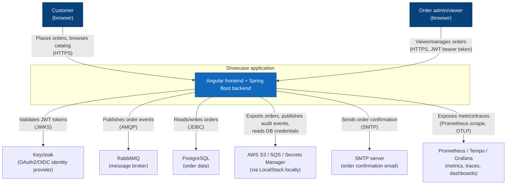
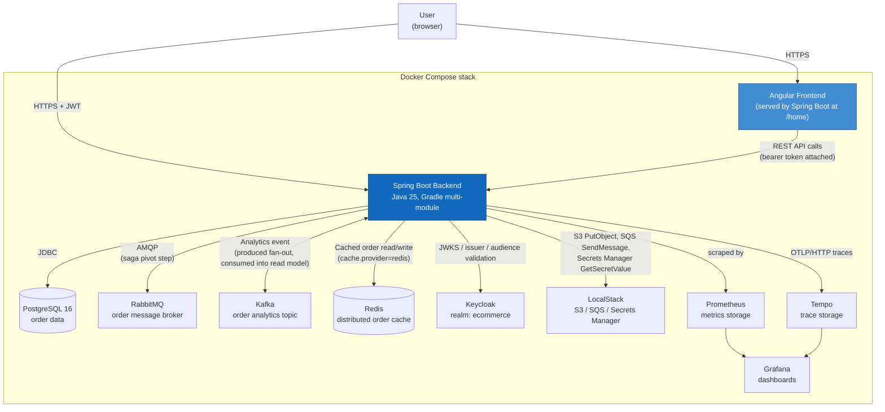
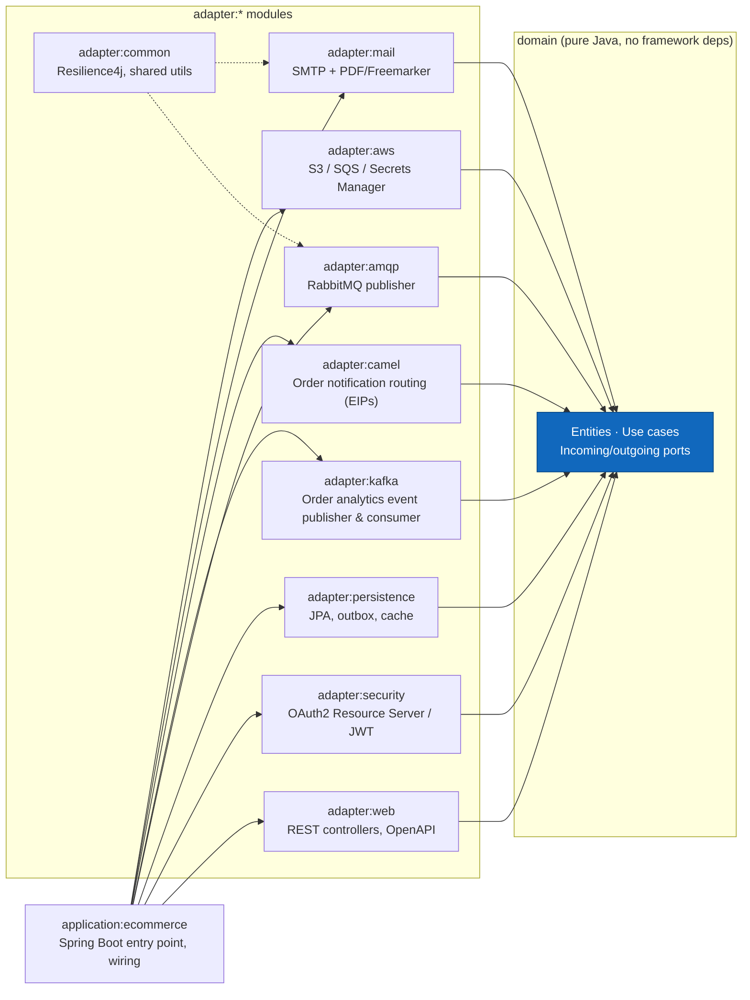
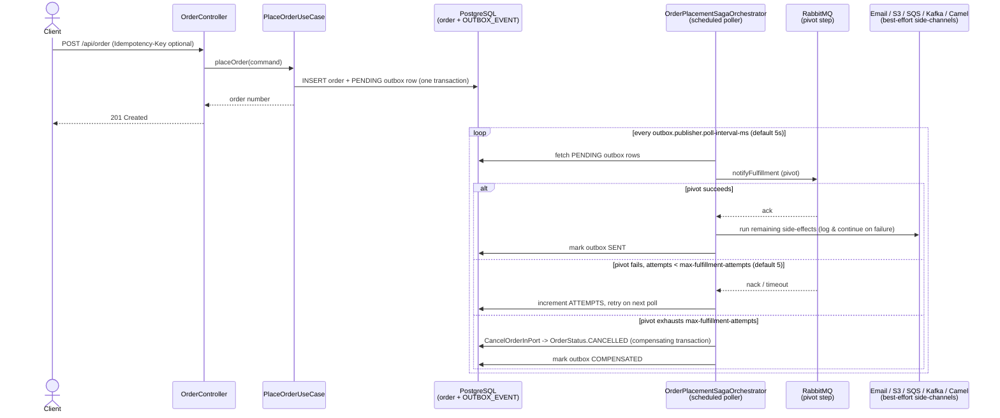

# Architecture diagrams

C4-style diagrams (context, container, and component level), plus one dynamic view of the
order-placement saga, for the e-commerce showcase, rendered as Mermaid so they display directly on
GitHub. See also the [ADRs](../adr/README.md) for the reasoning behind the key decisions shown here.

## System context

Who/what interacts with the system, and which external systems it depends on.

## Containers

The deployable units that make up the system (matches `docker-compose.yml` at the repo root).

## Backend module structure (hexagonal architecture)

How the Gradle modules map to ports & adapters (see [ADR 0001](../adr/0001-hexagonal-architecture.md)).

## Dynamic view: order placement saga

Placing an order returns as soon as it's durably saved; everything else (fulfillment, e-mail,
audit export, analytics, routing) is driven asynchronously by an orchestrator polling the
transactional outbox, with RabbitMQ fulfillment as the retried *pivot* step and a compensating
cancellation if it never succeeds (see [ADR 0009](../adr/0009-order-placement-saga.md) and
[Order placement saga](../../README.md#order-placement-saga)).

## Cross-cutting concerns

Two behaviors apply across the order API without changing the topology shown above:

- **Problem Details (RFC 9457)** - every error response (validation failure, business-rule
  violation, idempotency-key conflict, not-found, ...) is a `application/problem+json` body with a
  stable `type` URI and a correlatable `errorId`, handled centrally by `GlobalExceptionHandler` -
  see [Error handling](../../README.md#error-handling).
- **Idempotency-Key** - `POST /api/order` accepts an optional client-generated key so a retried
  request (e.g. after a client-side timeout) safely replays the original result instead of placing
  a duplicate order, arbitrated by a database unique constraint rather than application-level
  locking - see [Idempotent order placement](../../README.md#idempotent-order-placement).
